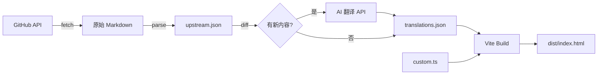

# OpenSpec Guide — Vite 迁移 & 上游自动同步

将当前纯静态 `index.html`（48KB 单文件）迁移为 Vite + 原生 TS 项目，实现每日自动从 OpenSpec GitHub 仓库抓取最新文档、解析、翻译、构建。

## User Review Required

> [!NOTE]
> **AI 翻译 API**：已确认使用 DeepSeek API（`deepseek-chat` 模型，base_url: `https://api.deepseek.com`），兼容 OpenAI SDK。API Key 通过环境变量 `DEEPSEEK_API_KEY` 读取，构建前需设置。

> [!IMPORTANT]
> **部署平台确认**：计划中以 Zeabur 为主要部署目标。如果改用 VPS，cron 配置部分会有差异，请确认。

---

## 总体架构

```
openspec-guide/
├── scripts/
│   ├── fetch-upstream.ts      ← 从 GitHub API 拉取文档
│   ├── parse-docs.ts          ← 解析 Markdown → 结构化 JSON
│   ├── translate.ts           ← AI 翻译新增内容
│   └── build-data.ts          ← 编排入口：拉取 → 对比 → 解析 → 翻译 → 输出
├── src/
│   ├── data/
│   │   ├── upstream.json      ← 构建时自动生成（不入 Git）
│   │   ├── translations.json  ← AI 翻译缓存（入 Git，避免重复翻译）
│   │   └── custom.ts          ← 固定中文内容（口诀、场景描述等）
│   ├── sections/              ← 各页面区块渲染函数
│   │   ├── hero.ts
│   │   ├── commands.ts
│   │   ├── workflow.ts
│   │   ├── scenario.ts
│   │   ├── reference.ts
│   │   ├── tools.ts
│   │   └── footer.ts
│   ├── style.css              ← 沿用现有 CSS 设计
│   ├── main.ts                ← 入口
│   └── types.ts               ← 数据类型定义
├── index.html
├── .last-sha                  ← 记录上次构建的 commit SHA（无变化跳过）
├── vite.config.ts
├── tsconfig.json
└── package.json
```

---

## Proposed Changes

### 数据层

#### [NEW] [fetch-upstream.ts](file:///Users/ivan/Downloads/ai_coding/openspec-guide/scripts/fetch-upstream.ts)

- 使用 GitHub REST API 拉取以下文件的最新内容：
  - `docs/commands.md` — 命令参考
  - `docs/supported-tools.md` — 工具列表
  - `docs/opsx.md` — OPSX 工作流
  - `README.md` — 概览信息
- 获取 `main` 分支最新 commit SHA，与 `.last-sha` 对比
- 无变化时提前退出，输出 `"No changes detected, skipping build"`

#### [NEW] [parse-docs.ts](file:///Users/ivan/Downloads/ai_coding/openspec-guide/scripts/parse-docs.ts)

- 解析 `commands.md`：提取每个命令的名称、语法、参数、描述、示例
- 解析 `supported-tools.md`：提取工具名称列表、Skills 位置、Commands 位置
- 解析 `README.md`：提取版本要求、推荐模型等元信息
- 输出结构化 JSON 到 `src/data/upstream.json`

#### [NEW] [translate.ts](file:///Users/ivan/Downloads/ai_coding/openspec-guide/scripts/translate.ts)

- 对比 `upstream.json` 与 `translations.json`，找出新增/变更的条目
- 调用 AI API 将新增英文内容翻译为中文
- 翻译结果写入 `translations.json`（作为缓存，避免重复翻译和费用浪费）
- 已有翻译且原文未变的条目直接复用缓存

#### [NEW] [build-data.ts](file:///Users/ivan/Downloads/ai_coding/openspec-guide/scripts/build-data.ts)

- 编排入口脚本，按顺序执行：fetch → compare SHA → parse → translate → output
- 在 `package.json` 中注册为 `"prebuild": "tsx scripts/build-data.ts"`

---

### 页面渲染层

#### [NEW] `src/sections/*.ts`

每个区块一个渲染函数，接收数据参数，返回 HTML 字符串或直接操作 DOM：

| 文件 | 对应区块 | 数据来源 |
|------|---------|---------|
| `hero.ts` | 首屏 | `custom.ts`（口诀等固定内容） |
| `commands.ts` | 命令分类 | `upstream.json` + `translations.json` |
| `workflow.ts` | 工作流对比 | `custom.ts`（终端演示为固定内容） |
| `scenario.ts` | 实战演练 | `custom.ts`（场景为固定内容） |
| `reference.ts` | 速查表 | `upstream.json` + `translations.json` |
| `tools.ts` | 工具兼容 | `upstream.json`（工具列表自动生成） |
| `footer.ts` | 页脚 | `custom.ts` |

#### [MODIFY] [style.css](file:///Users/ivan/Downloads/ai_coding/openspec-guide/src/style.css)

- 从现有 `index.html` 的 `<style>` 标签中提取全部 CSS，独立成文件
- 不做任何视觉改动，保持完全一致

#### [NEW] [main.ts](file:///Users/ivan/Downloads/ai_coding/openspec-guide/src/main.ts)

- 导入数据和各区块渲染函数
- 初始化页面，绑定交互（Workflow tabs 切换、滚动动画等）

---

### 项目配置

#### [NEW] [vite.config.ts](file:///Users/ivan/Downloads/ai_coding/openspec-guide/vite.config.ts)

- 基础 Vite 配置，无需框架插件

#### [NEW] [package.json](file:///Users/ivan/Downloads/ai_coding/openspec-guide/package.json)

关键脚本：

```json
{
  "scripts": {
    "fetch": "tsx scripts/build-data.ts",
    "dev": "vite",
    "prebuild": "tsx scripts/build-data.ts",
    "build": "vite build",
    "preview": "vite preview"
  }
}
```

#### [DELETE] [index.html (旧)](file:///Users/ivan/Downloads/ai_coding/openspec-guide/index.html)

- 旧的 48KB 单文件将被新的 Vite 项目替代
- 内容和样式全部迁移到新结构中

---

### 部署 & 定时构建

#### [NEW] [scripts/build.sh](file:///Users/ivan/Downloads/ai_coding/openspec-guide/scripts/build.sh)

```bash
#!/bin/bash
# Zeabur / VPS cron 构建脚本
cd /path/to/openspec-guide
npm run build 2>&1 | tee build.log
# prebuild 阶段会自动检查 SHA，无变化则跳过
```

- Zeabur 部署：配置为静态站点，构建命令 `npm run build`，输出目录 `dist/`
- cron 配置（VPS）：`0 3 * * * /path/to/scripts/build.sh`（每天凌晨 3 点）

---

## 数据流概览



---

## Verification Plan

### 自动验证

```bash
# 1. 安装依赖
pnpm install

# 2. 运行数据抓取脚本，验证能正确拉取和解析
pnpm run fetch

# 3. 构建项目
pnpm run build

# 4. 本地预览
pnpm run preview
```

### 手动验证

1. **视觉对比**：在浏览器中打开旧版 `index.html` 和新版 `dist/index.html`，对比页面风格是否一致
2. **数据准确性**：检查页面上的命令列表、工具列表是否与 [OpenSpec commands.md](https://github.com/Fission-AI/OpenSpec/blob/main/docs/commands.md) 一致
3. **交互功能**：验证 Workflow tabs 切换、滚动动画是否正常
4. **无变化跳过**：连续运行两次 `pnpm run fetch`，第二次应输出 "No changes detected"
